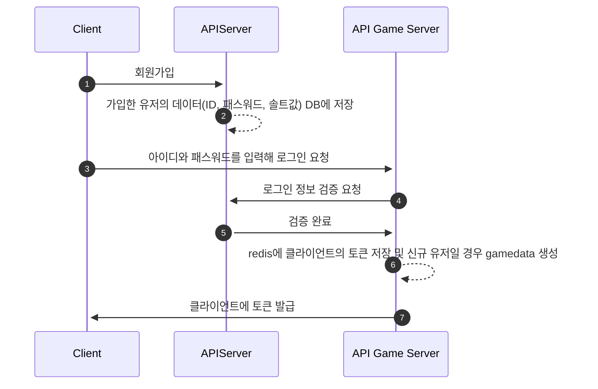

```mermaid
  sequenceDiagram
    participant client as Client
    participant apiserver as APIServer
    participant apigameserver as API Game Server
    
    autonumber
    
    client ->>+ apiserver: 회원가입
    apiserver -->> apiserver: 가입한 유저의 데이터(ID, 패스워드, 솔트값) DB에 저장
    client ->>+ apigameserver: 아이디와 패스워드를 입력해 로그인 요청
    apigameserver ->> apiserver: 로그인 정보 검증 요청
    apiserver ->>+ apigameserver: 검증 완료
    apigameserver -->> apigameserver: redis에 클라이언트의 토큰 저장 및 신규 유저일 경우 gamedata 생성
    apigameserver ->>+ client: 클라이언트에 토큰 발급

```
