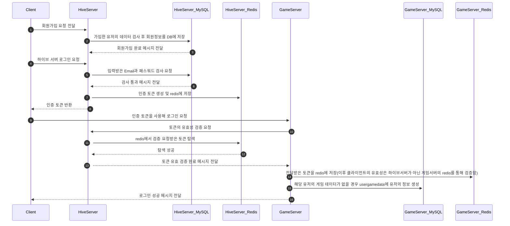

```mermaid
  sequenceDiagram
    participant client as Client
    participant hiveserver as HiveServer
    participant hiveserver_mysql as HiveServer_MySQL
    participant hiveserver_redis as HiveServer_Redis
    participant gameserver as GameServer
    participant gameserver_mysql as GameServer_MySQL
    participant gameserver_redis as GameServer_Redis
    
    autonumber
    
    client ->>+ hiveserver: 회원가입 요청 전달
    hiveserver ->>+ hiveserver_mysql: 가입한 유저의 데이터 검사 후 회원정보를 DB에 저장
    hiveserver_mysql -->> hiveserver: 회원가입 완료 메시지 전달
    client ->>+ hiveserver: 하이브 서버 로그인 요청
    hiveserver ->>+ hiveserver_mysql: 입력받은 Email과 패스워드 검사 요청
    hiveserver_mysql -->> hiveserver: 검사 통과 메시지 전달
    hiveserver ->>+ hiveserver_redis: 인증 토큰 생성 및 redis에 저장
    hiveserver -->> client: 인증 토큰 반환
    client ->>+ gameserver: 인증 토큰을 사용해 로그인 요청
    gameserver ->>+ hiveserver: 토큰의 유효성 검증 요청
    hiveserver ->>+ hiveserver_redis: redis에서 검증 요청받은 토큰 탐색
    hiveserver_redis -->> hiveserver: 탐색 성공 
    hiveserver -->> gameserver: 토큰 유효 검증 완료 메시지 전달
    gameserver ->>+ gameserver_redis: 전달받은 토큰을 redis에 저장(이후 클라이언트의 유효성은 하이브서버가 아닌 게임서버의 redis를 통해 검증함)
    gameserver ->>+ gameserver_mysql: 해당 유저의 게임 데이터가 없을 경우 usergamedata에 유저의 정보 생성
    gameserver -->> client: 로그인 성공 메시지 전달

```
